# 📅 RUET Routine Management System

A **full-stack MERN** (MongoDB, Express.js, React.js, Node.js) web application for automating and managing class schedules at **Rajshahi University of Engineering & Technology (RUET)**. This project modernizes the traditional, manual routine creation process by introducing an interactive, dynamic, and conflict-aware web-based platform.

  
*Official Routine Reference*

  
*Web-based Generated Routine*

---

## 🚀 Features

### 📚 Routine Structure & Constraints
- **Batches & Sections**: Supports all 4 academic years with Sections A, B, and C.
- **Room & Lab Management**:
  - 7 Classrooms: `101`, `102`, `103`, `104`, `201`, `202`, `203`
  - 8 Labs: `HPCL Lab`, `PG Lab`, `OS Lab`, `NW Lab`, `SW Lab`, `HW Lab`, `ACL Lab`, `Mobile Apps Lab`
  - Labs have a max capacity of **30 students**
  - Labs(Even Code) can be held only on the 1st, 4th, and 7th periods
  - Lab classes will occupy 3 consecutive periods.

- **Time Constraints**:
  - Weekends: **Thursday & Friday** off
  - Breaks: `10:30 AM – 10:50 AM` and `1:20 PM – 2:30 PM`
  - Courses: 5 theory + multiple lab sessions (1.5 or 0.75 credit)
    
- **Real-time Conflict Detection**:
  - Duplicate teachers or rooms flagged in a **"Duplicates"** column
  - Duplicate input of a teacher or if the classes overlap in different rooms and sections, if such an entry is given, it will show a conflict
  - A teacher can have at most 2 classes a day, and it has to be in adjacent periods; otherwise, it will show a conflict
  - Lab classes(even code) must be taken at the 1st, 4th or 7th period. Lab classes will occupy 3 consecutive periods.
    
- **Teacher Constraints**:
  - A single teacher can take a maximum of 2 classes a day per section, and they must be **adjacent periods**
  - A single teacher can't take classes in different sections at the same period [time]. If such an entry is given, it will show a conflict.
    
- **Room Constraints**:
  - Two different classes can not be taken in the same room at the same time. If such an entry is given, it will show a conflict.

- **Seniority Sorting**:
  - Whenever a new batch entry is given, routine sorts in order: 4th year → 3rd year→ 2nd → 1st

### ⚙️ Dynamic Routine Management
>Routine Features:

- **Add Batch Button**:
   - Adding a batch auto-generates rows for its 3 sections. Means adding a single batch will create a row for 3 sections (A, B, and C)

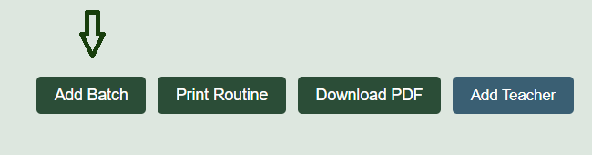 

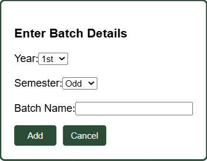  

- **Seniority Sorting**:
  - Whenever a new batch entry is given, routine sorts in order: **4th year → 3rd year→ 2nd → 1st**

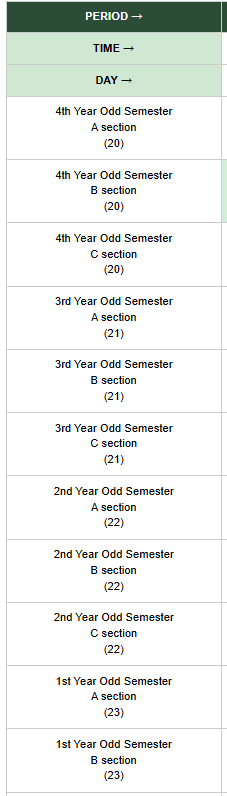 

- **Delete Batch Button**:
   - Deletes that particular batch from all days (SAT-WED).

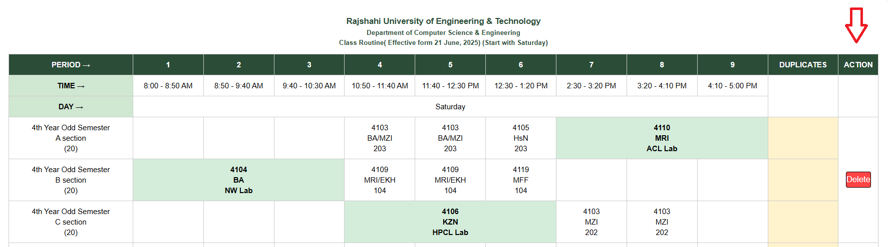 

- **Edit Cell**:
   - When a single cell is clicked, an EditCell popup will show, where we can add cell information like `course code`, `teacher's name`, `room/lab` and also add additional rooms and teachers taking a single course.
   - The `Save button` saves the cell information.
   - The `Cancel button` cancels the operation and popup.
   - The `Delete Cell` button clears out cell data.

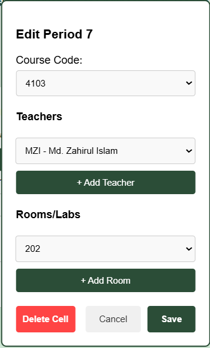 

- **Print Routine**:
  - Full Routine can be printed upon clicking the Print Routine button

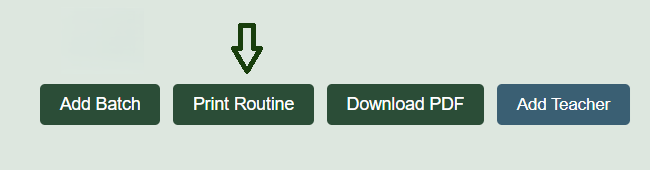 

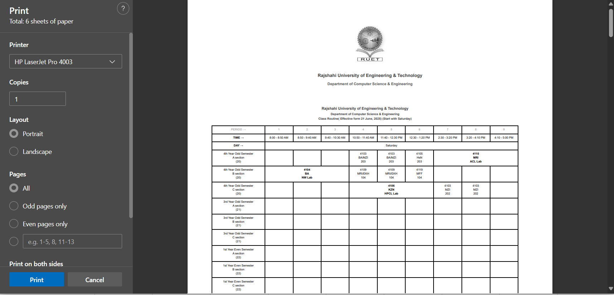 

- **Routine Export (Download)**:
  - Export full routine as **PDF** upon clicking download button

  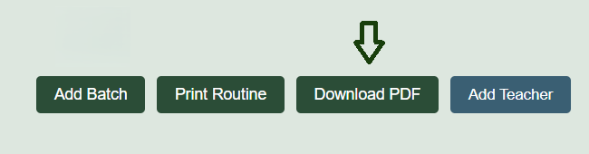 

- **Add Teacher**:
  - `Add teacher` button helps in **Teacher Management**, where we can add teacher information such as `Full name`, `Short Form`, `Designation`, `Department` and `University`. 

  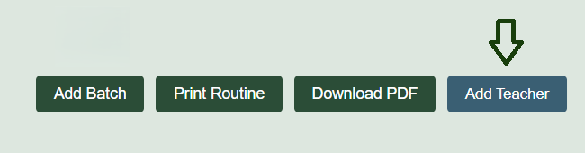 

  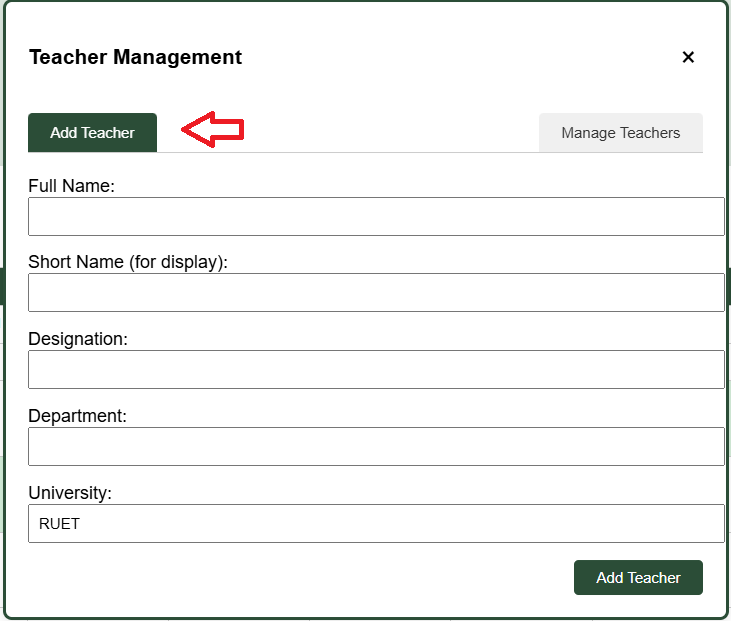 

  - `Manage teacher` button helps in identifying teachers and provides deletion feature
  
  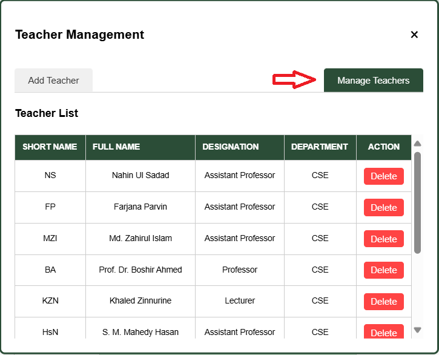 

- **Real-time Conflict Detection**:
  - Duplicate teachers or rooms flagged in a **"Duplicates"** column

  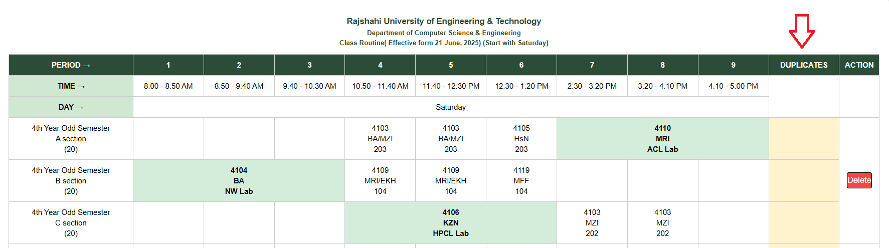 

  - Duplicate input of a teacher or if the classes overlap in different rooms and sections, if such an entry is given, it will show conflict

  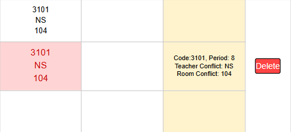 

  - A teacher can have at most 2 classes a day, and it has to be in adjacent periods; otherwise, it will show conflict

  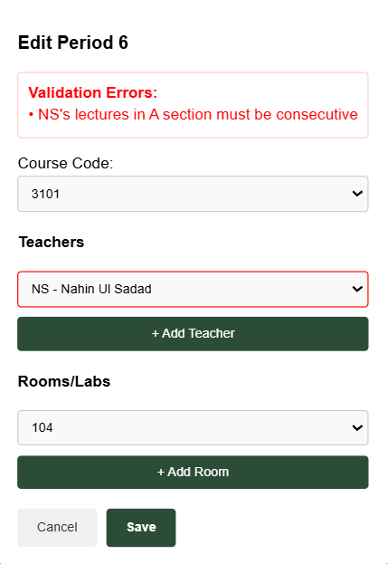 

  - Lab classes(even code) must be taken at the 1st, 4th or 7th period. Lab classes will occupy 3 consecutive periods.  
  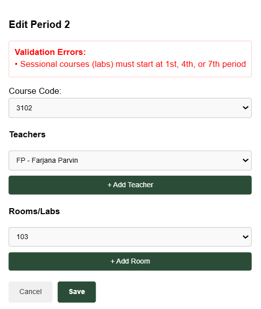 
  
  - Conflict entries can be handled by deletion. 

---

## 🛠️ Tech Stack

| Layer       | Tech                     |
|-------------|--------------------------|
| Frontend    | React.js, JavaScript     |
| Backend     | Node.js, Express.js      |
| Database    | MongoDB (NoSQL)          |
| Deployment  | Microsoft Azure (Cloud)  |

---

## 🎯 Project Objectives
- Eliminate manual routine creation errors
- Minimize room/teacher conflicts
- Simplify schedule updates and modifications
- Enable efficient classroom/lab utilization
- Deploying a scalable and user-friendly application

---

## ✅ Outcomes
- 📉 Reduced manual routine creation errors
- 📈 Increased efficiency and room utilization
- 🧠 Smart teacher & room conflict resolution
- 🎯 Flexible scheduling with minimal errors
- 🖱️ Seamless UI/UX for admins

---

## 📸 Screenshots

### 🗂 Reference Routine (Manual System)
> Screenshot of official RUET routine used for design reference.

### 📊 Generated Routine (Web-Based System)
> Dynamically created routine with real-time editing, conflict management, and slot visualization.

---

## 🔧 Future Enhancements
Features I plan to integrate in the future:
- **Secure Login / Authentication System** to manage access for admins, teachers, and students.
- The current app is built only for admins. I plan to create :
  - **Dedicated Teacher Dashboard**:  
    Provide a separate interface for teachers to:
    - Request available time slots for class tests (CT) or extra class.
    - View their personalized teaching schedules
  
  - **Student Portal**:  
    Enable a student-friendly view where students can:
    - Access the most up-to-date routine
    - Export or print schedules easily

---

## ✍️ Created By

**Mysha Ahmed**
- CSE'20
- Department of Computer Science & Engineering
- **Rajshahi University of Engineering & Technology (RUET)**