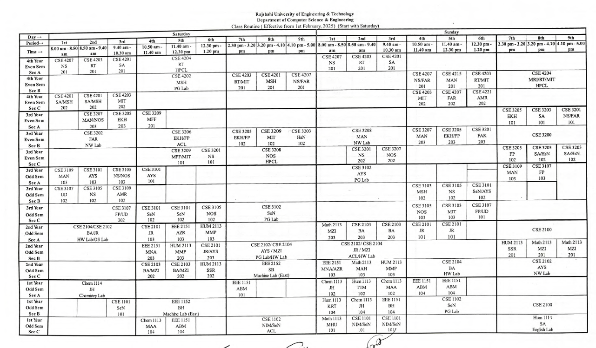

# 📅 RUET Routine Management System

A **full-stack MERN** (MongoDB, Express.js, React.js, Node.js) web application for automating and managing class schedules at **Rajshahi University of Engineering & Technology (RUET)**. This project modernizes the traditional, manual routine creation process by introducing an interactive, dynamic, and conflict-aware web-based platform.

  
*Official Routine Reference*

  
*Web-based Generated Routine*

---

## 🚀 Features

### 📚 Routine Structure & Constraints
- **Batches & Sections**: Supports all 4 academic years with Sections A, B, and C.
- **Room & Lab Management**:
  - 7 Classrooms: `101`, `102`, `103`, `104`, `201`, `202`, `203`
  - 8 Labs: `HPCL`, `PG Lab`, `OS Lab`, `NW Lab`, `SW Lab`, `HW Lab`, `ACL`, `Mobile Apps Lab`
  - Labs have a max capacity of **30 students**
- **Time Constraints**:
  - Weekends: **Thursday & Friday** off
  - Breaks: `10:30 AM – 10:50 AM` and `1:20 PM – 2:30 PM`
  - Courses: 5 theory + multiple lab sessions (1.5 or 0.75 credit)

---

### ⚙️ Dynamic Routine Management
- **Auto Batch Setup**: Adding a batch auto-generates rows for its 3 sections
- **Real-time Conflict Detection**:
  - Duplicate teachers or rooms flagged in a **"Duplicates"** column
- **Teacher Constraints**:
  - A single teacher can take max 2 classes a day per section, must be **adjacent periods**
- **Interactive Editing**:
  - Click on a routine cell to open a popup for editing
- **Routine Export**:
  - Export full routine as **PDF**
- **Seniority Sorting**:
  - Routines sorted in order: 4th year → 3rd → 2nd → 1st

---

## 🛠️ Tech Stack

| Layer       | Tech                     |
|-------------|--------------------------|
| Frontend    | React.js, JavaScript     |
| Backend     | Node.js, Express.js      |
| Database    | MongoDB (NoSQL)          |
| Deployment  | Microsoft Azure (Cloud)  |

---

## 🎯 Project Objectives
- Eliminate manual routine creation errors
- Minimize room/teacher conflicts
- Simplify schedule updates and modifications
- Enable efficient classroom/lab utilization
- Deploy a scalable and user-friendly application

---

## ✅ Outcomes
- 📉 Reduced manual routine creation errors
- 📈 Increased efficiency and room utilization
- 🧠 Smart conflict resolution
- 🎯 Flexible scheduling with minimal errors
- 🖱️ Seamless UI/UX for admins

---

## 📸 Screenshots

### 🗂 Reference Routine (Manual System)
> Screenshot of official RUET routine used for design reference.

### 📊 Generated Routine (Web-Based System)
> Dynamically created routine with real-time editing, conflict management, and slot visualization.

---

## ✍️ Created By

**Mysha Ahmed**
- CSE'20
- Department of Computer Science & Engineering
- **Rajshahi University of Engineering & Technology (RUET)**

