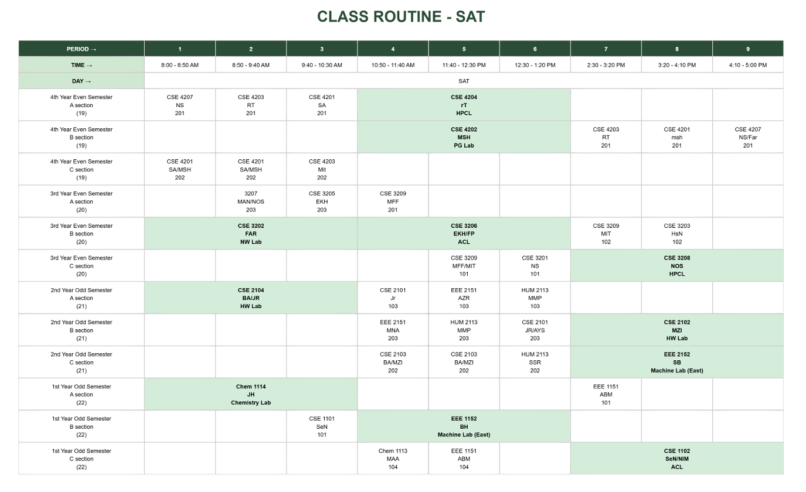

# 📅 RUET Routine Management System

A **full-stack MERN** (MongoDB, Express.js, React.js, Node.js) web application designed to automate and manage class schedules at **Rajshahi University of Engineering & Technology (RUET)**. This system replaces the traditional, manual routine creation process with a dynamic, interactive, and conflict-aware web platform. 

  
   
  <em>Official Routine Reference</em>

  
   
  <em>Web-Based Generated Routine</em>

---

## 🚀 Features

### 📚 Routine Structure & Constraints

- **Batches & Sections**: Supports all 4 academic years with Sections A, B, and C.

- **Room & Lab Management**:
  - 7 Classrooms: `101`, `102`, `103`, `104`, `201`, `202`, `203`
  - 8 Labs: `HPCL Lab`, `PG Lab`, `OS Lab`, `NW Lab`, `SW Lab`, `HW Lab`, `ACL Lab`, `Mobile Apps Lab`
  - Labs accommodate **up to 30 students**
  - Labs (even-coded) must be scheduled during **1st, 4th, or 7th periods**
  - Lab classes occupy 3 consecutive periods.

- **Time Constraints**:
  - Weekends: **Thursday & Friday** off
  - Breaks: `10:30 AM – 10:50 AM` and `1:20 PM – 2:30 PM`
  - Courses: 5 theory + multiple lab sessions (1.5 or 0.75 credit)
    
- **Conflict Detection**:
  - Duplicate teachers or room entries are flagged in a **"Duplicates"** column
  - No overlapping classes across different sections or rooms; wrong entry will show a conflict
  - Teachers can take **a maximum of 2 adjacent classes per day**; otherwise, it will show a conflict
  - Lab classes(even code) must be taken at the 1st, 4th or 7th period. Lab classes will occupy 3 consecutive     periods.
    
- **Teacher Constraints**:
  - A single teacher can take a maximum of 2 classes a day per section, and they must be **adjacent periods**
  - A single teacher can't take classes in different sections at the same period [time]. If such an entry is given, it will show a conflict.
    
- **Room Constraints**:
  - Two different classes can not be taken in the same room at the same time. If such an entry is given, it will show a conflict.

- **Seniority Sorting**:
  - Whenever a new batch entry is given, routine sorts in order: 4th year → 3rd year→ 2nd year → 1st year

---

### ⚙️ Dynamic Routine Management

#### 🧩 Features Overview

  

#### ➕ Add Batch Button:

- Adding a batch auto-generates rows for its 3 sections (A, B & C). 
  

  
  

#### 🔄 Seniority Sorting:

- Whenever a new batch entry is given, routine sorts in order: **4th year → 3rd year→ 2nd year → 1st year**

  

#### ❌ Delete Batch Button:

- Deletes that particular batch from all days (SAT-WED).

  

#### 📝 Edit Cell:

- When a single cell is clicked, an EditCell popup will show, where we can add cell information like `code`, `teacher's name`, `room/lab` and also add additional rooms and teachers taking a single course.
- The `Save button` saves the cell information.
- The `Cancel button` cancels the operation and pop-up.
- The `Delete Cell` button clears out cell data.

  

#### 🖨️ Print & Export

- **Print Routine**:
  - Full Routine can be printed upon clicking the Print Routine button

    
   
    

- **Download PDF**:
  - Export full routine as **PDF** upon clicking download button

  

    
  

#### 👨‍🏫 Teacher Management

- **Add Teacher**:
  - Add teacher details: Name, Short Form, Designation, Department, University 

  

  
  
  

- **Manage/delete teachers**:  
  - `Manage teacher` button helps in identifying teachers and provides deletion feature
  
  

    
  

---

### ⚠️ Real-time Conflict Detection

- **Duplicates Section** 
  - Duplicate teachers or rooms flagged in a **"Duplicates"** column

  

    
  

- **Overlapping or Invalid Entries** 
  - Duplicate input of a teacher or if the classes overlap in different rooms and sections, if such an entry is given, it will show conflict

  

    
  

- **Constraint Violation (non-adjacent periods)** 
  - A teacher can have at most 2 classes a day, and it has to be in adjacent periods; otherwise, it will show conflict

  

    
  

- **Invalid Lab Timing (periods not 1st, 4th, or 7th)**  
  - Lab classes(even code) must be taken at the 1st, 4th or 7th period. Lab classes will occupy 3 consecutive periods.  
  

    
  

- Conflict entries can be resolved by deletion. 

---

## 🛠️ Tech Stack

| Layer       | Tech                     |
|-------------|--------------------------|
| Frontend    | React.js, JavaScript     |
| Backend     | Node.js, Express.js      |
| Database    | MongoDB (NoSQL)          |
| Deployment  | Microsoft Azure (Cloud)  |

---

## 🎯 Project Objectives

- Eliminate manual errors in routine creation 
- Minimize teacher and room conflicts
- Simplify routine updates and management  
- Ensure efficient utilization of rooms and labs 
- Deliver a scalable, user-friendly admin interface

---

## ✅ Outcomes

- 📉 Significantly reduced routine creation errors  
- 📈 Optimized class/lab allocation and scheduling  
- 🧠 Intelligent conflict handling and resolution  
- 🎯 Flexible scheduling with minimal errors
- 🖱️ Smooth and intuitive admin interface

---

## 📸 Screenshots

### 🗂 Reference Routine (Manual System)
> Screenshot of official RUET routine used for design reference.

  

### 📊 Generated Routine (Web-Based System)
> Dynamically created routine with real-time editing, conflict management, and slot visualization.

  

---

## 🔧 Future Enhancements

Features I plan to integrate in the future:

- **Secure Login / Authentication System** to manage access for admins, teachers, and students separetely.
- The current app is built only for admins. I plan to create :
  - **Dedicated Teacher Dashboard**:  
    Provide a separate interface for teachers to:
    - Request available time slots for class tests (CT) or extra class.
    - View their personalized teaching schedules
  
  - **Student Portal**:  
    Enable a student-friendly view where students can:
    - Access the most up-to-date routine
    - Export or print schedules easily

---

## ✍️ Created By

**Mysha Ahmed**
- CSE'20
- Department of Computer Science & Engineering
- **Rajshahi University of Engineering & Technology (RUET)**